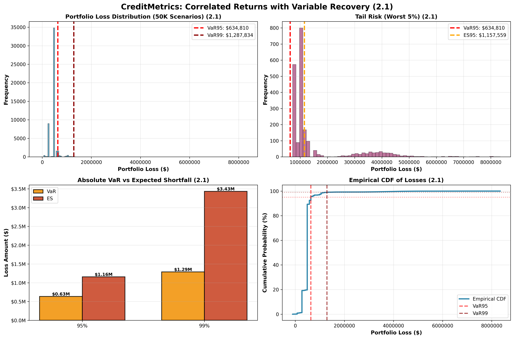
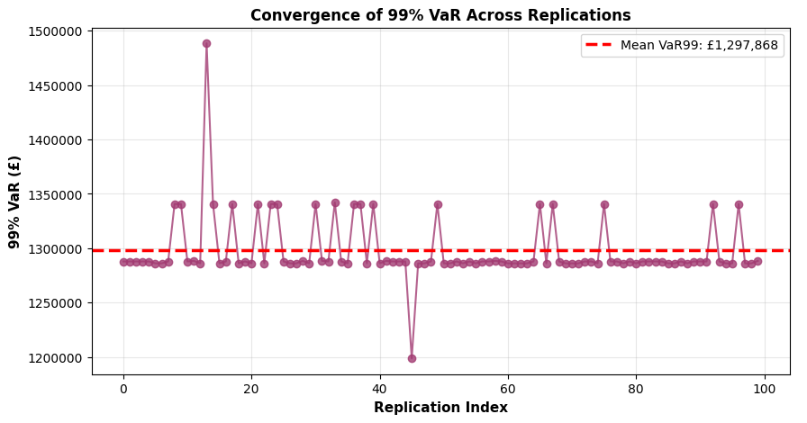

# Credit Portfolio Risk Modelling – CreditMetrics Framework

An end-to-end credit portfolio risk model built in Excel and Python to estimate portfolio loss distributions, Credit VaR, and Expected Shortfall for a multi-name corporate book using the CreditMetrics methodology.

---

## Objective

Quantify the credit risk of a diversified corporate loan portfolio by modelling the full distribution of portfolio losses under rating migration and default scenarios. The model estimates:

- **Absolute VaR (95%)** — portfolio loss at the 95th percentile
- **Expected Shortfall (ES) (95%)** — mean loss in the tail beyond the 95% threshold
- **Absolute VaR (99%)** — portfolio loss at the 99th percentile
- **Expected Shortfall (ES) (99%)** — mean loss in the tail beyond the 99% threshold
  
---

## Repository Structure

```
credit-portfolio-risk-creditmetrics/
├── README.md
├── Results.md
├── CreditPortfolio_Model.xlsx        # Full Excel model: inputs, transitions, correlations
├── 2.1.ipynb                         # Monte Carlo simulation engine for 1 year Absolute VaR and ES
├── 2.2.ipynb                         # Monte Carlo simulation engine for 2 year Absolute VaR and ES
├── 2.3.ipynb                         # VaR stability and convergence analysis
├── 2.4                               # Stress Test Scenarios
│   ├── 2.4A.ipynb                    # Probability of Default Shock
│   ├── 2.4B.ipynb                    # Interest Rate Shock
│   ├── 2.4C.ipynb                    # Credit Spread Shock
│   ├── 2.4D.ipynb                    # Correlation Shock
│   ├── 2.4E.ipynb                    # Combined Shock               
├── images/
    ├── Loss Distribution/
        ├── 2.1.png
        ├── 2.2.png
        ├── 2.4A.png
        ├── 2.4B.png
        ├── 2.4C.png
        ├── 2.4D.png
        ├── 2.4E.png
    └── VaR Stability/
        ├── Distribution Across Replications.png
        ├── ES.png
        └── VaR.png 
```

## Portfolio

| Name | Ticker | Rating | Principle | Maturity | Coupon |
|---|---|---|---|---|---|
| Boyd Gaming Corp | BYD | Baa3| $4,000,000 | 3 Years | 6% |
| Brinker International Inc | EAT | Baa3| $5,000,000 | 4 Years | 7% |
| American Airlines Group Inc | BYD | B1| $6,000,000 | 5 Years | 8% |

---

## Methodology

### 1. Rating Transition Framework

Built a full rating migration model using Moody's historical transition probability matrices. Each obligor is assigned an initial rating, and the matrix maps the probability of migrating to any rating state (including default) over a one year horizon. Loss at each terminal state is calculated from the discounted value of remaining cash flows, incorporating state specific discount rates. This framework is implemented in Excel.

### 2. Recovery Rate Modelling

Recovery rates in default are modelled stochastically using a **beta distribution**, parameterised from historical recovery data by seniority class using `scipy.special` and `scipy.stats`. This avoids the oversimplification of a fixed recovery assumption and captures the observed dispersion in default recoveries, particularly the bi-modal clustering near zero and near par.

### 3. Forward Loan Valuation

Nielsen-Siegel Parameters were estimated before being used to calculate the one year spot and one year forward rate curves by credit rating. The cash flows for each loan were then discounted back to the present, using the forward curve of the loans possible rating 1 year from now.

### 4. Dependence Modelling via Asset Correlations

Pairwise asset correlations are estimated from **equity return histories** as a proxy for underlying asset value co-movements, consistent with the structural credit model framework. The correlation matrix is computed in Excel and feeds directly into the Python simulation engine: obligors in correlated industries or geographies are more likely to migrate together, which is critical for capturing concentration risk.

### 5. Monte Carlo Simulations (`2.1.ipynb`,`2.2.ipynb`, `2.4A.ipynb`, `2.4B.ipynb`, `2.4C.ipynb`, `2.4D.ipynb`, `2.4E.ipynb`)

The simulation engine is implemented in Python to overcome Excel's row limitations and enable reproducible, large scale trials. Using `numpy` for correlated normal draws and `pandas` for portfolio aggregation, each trial maps simulated asset returns to rating outcomes via transition thresholds derived from the transition matrix. Portfolio loss is summed across all obligors per trial and the full loss distribution is constructed. Results are visualised using `matplotlib`.

### 6. VaR Stability & Convergence Analysis (`2.3.ipynb`)

A dedicated notebook tests the stability of Credit VaR and Expected Shortfall estimates as the number of simulation trials increases. Using `scipy.stats` for distributional analysis and `matplotlib` for visualisation, this confirms that the chosen trial count is sufficient for stable tail estimates: an important validation step that demonstrates awareness of Monte Carlo estimation error.

### 7. Stress Testing & Scenario Analysis

Stress tests are applied to key model inputs to evaluate portfolio sensitivity:

- **Probability of Default Shock (2.4A)** — Probality of default set to maximum observed by Moody's over period 1920-2024
- **Interest Rate Shock (2.4B)** — Treasury Rate Curve Interpolated using 3M and 10Y average US treasury rates from 2000-2024
- **Credit Spread Shock (2.4C)** — Credit Spread for each rating increased by same % as % difference between 2025 probability of default and maximum observed probability of default for 1920-2024
- **Correlation Shock (2.4D)** — Maximum observed pairwise correlation between assets from 2007 to 2026 used
- **Combined Shock (2.4E)** — All previous shocks combined in this scenario

---

## Key Charts Produced by the Model

- Portfolio loss distribution (histogram with EL, VaR and ES marked)
  
- VaR and ES stability curves across increasing simulation trial counts
  

---

## Excel Model Structure

| Sheet | Description |
|---|---|
| **Transition Probabilities** | Moody's 2025 1Y transition matrix, transition Probabilities for each Company |
| **Valuation** | Variable recovery rates, 1Y forward valuations, current discounted portfolio value |
| **Correlation Calculations** | Correlation matrix, cholesky matrix |
| **VaR Calculation (2.1)** | Input Data, Credit Metrics |
| **Parameter Calculation (for 2.2)** | 2Y transition matrix, 2Y forward valuations |
| **VaR Calculation (2.2)** | Input Data, Credit Metrics |
| **Raw Data Needed for 2.4** | Treasury rates, correlation calculation |
| **Parameter Calculation (2.4)** | 2.4A, 2.4B, 2.4C, 2.4D, 2.4E |

---

## How to Run

**Requirements:** Python 3.8+

Install dependencies:
```bash
pip install numpy pandas matplotlib scipy
```

Run the notebooks in order:

1. **`2.1.ipynb`** — Monte Carlo simulation. Reads portfolio inputs and correlation matrix, runs correlated asset return simulations, outputs the portfolio loss distribution with EL, VaR and ES estimates.
   
2. **`2.2.ipynb`** — Monte Carlo simulation for 2 years. Reads portfolio inputs and correlation matrix, runs correlated asset return simulations, outputs the portfolio loss distribution with EL, VaR and ES estimates.

3. **`2.3.ipynb`** — VaR stability analysis. Re-runs the simulation across increasing trial counts and plots convergence of VaR and ES to confirm estimate reliability.

4. **`2.4A.ipynb`** — Monte Carlo simulation for scenario 2.4A. Reads portfolio inputs and correlation matrix, runs correlated asset return simulations, outputs the portfolio loss distribution with EL, VaR and ES estimates.

5. **`2.4B.ipynb`** — Monte Carlo simulation for scenario 2.4B. Reads portfolio inputs and correlation matrix, runs correlated asset return simulations, outputs the portfolio loss distribution with EL, VaR and ES estimates.

6. **`2.4C.ipynb`** — Monte Carlo simulation for scenario 2.4C. Reads portfolio inputs and correlation matrix, runs correlated asset return simulations, outputs the portfolio loss distribution with EL, VaR and ES estimates.

7. **`2.4D.ipynb`** — Monte Carlo simulation for scenario 2.4D. Reads portfolio inputs and correlation matrix, runs correlated asset return simulations, outputs the portfolio loss distribution with EL, VaR and ES estimates.

5. **`2.4E.ipynb`** — Monte Carlo simulation for scenario 2.4E. Reads portfolio inputs and correlation matrix, runs correlated asset return simulations, outputs the portfolio loss distribution with EL, VaR and ES estimates.
   
All notebooks are self contained with inline commentary explaining each step.

---

## Data Sources

| Input | Source |
|---|---|
| Rating transition probabilities | Moody's Annual Default Study |
| Recovery rate assumptions | Moody's historical LGD data by seniority |
| Asset correlations | Market equity return histories (proxied from public data) |
| Portfolio exposures | Hypothetical multi name corporate portfolio |

---

## Skills & Tools

`Python` `NumPy` `pandas` `Matplotlib` `SciPy` `Excel Financial Modelling`  
`Credit Risk Modelling` `CreditMetrics` `Monte Carlo Simulation` `Rating Transition Matrices`  
`Recovery Rate Modelling` `Asset Correlation` `VaR & Expected Shortfall` `Stress Testing`  
`Portfolio Loss Distribution` `Quantitative Risk Analysis` `Credit Analytics`

---

## Potential Extensions

- **Gaussian or t-copula** to more flexibly model tail dependence between obligors beyond linear correlation
- **CDS implied PDs** to replace historical transition matrices with market-implied default probabilities, making the model forward-looking
- **Incremental VaR** calculation to formally decompose portfolio risk to individual obligors
- **Multi period horizon** simulation to model the evolution of credit quality over 3–5 years
- **Interactive dashboard** using Plotly or Streamlit to allow scenario inputs to be adjusted dynamically

---

## Author

**Kobby Akuoko**    
